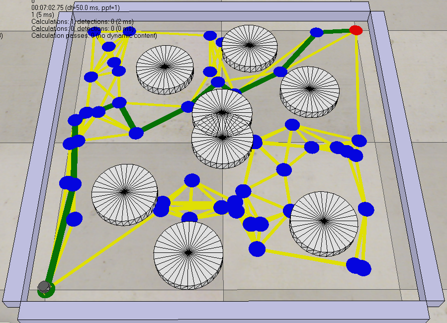

# Sampling-Based Robot Path Planning Using Probabilistic Roadmap (PRM) 🗺️

This repository contains my implementation of the **Probabilistic Roadmap Method (PRM)**, a sampling-based path planner developed as a programming project for the Coursera course: "Modern Robotics, Course 4: Robot Motion Planning and Control".

---

## 💡 Project Description 

This PRM approach involves the uniform random sampling of nodes in the C-space, connecting nearby nodes to form a graph while avoiding obstacles, and using A* search on this graph to find a collision-free path for a point robot navigating a cluttered 2D planar environment. The configuration space is a square  [-0.5, 0.5] x [-0.5, 0.5], with fixed start and goal nodes at (-0.5, -0.5) and (0.5, 0.5) respectively.


---


## 🛠️ Technology Used

- **Language:** Python
- **Libraries:** csv, heapq, math, random (all standard Python libraries, no external installation required). 
- **Simulation Tool:** CoppeliaSim

---

## 📁 Project Folder Structure
<pre>
├── code/
│ ├── prm_path_planner.py # Python program implementing PRM
├── parameters/
│ ├── parameters.txt # holds variables used as input into the program
├── results/
│ ├── edges.csv
│ ├── nodes.csv
│ ├── obstacles.csv
│ └── path.csv
├── README.md
├── recording_A_star_search_robot_planner_simulation.avi
├── Scene5_motion_planning.ttt
└── screenshot_A_star_search_robot_planner.png
</pre>
    
---

## 🚀 Getting Started

---

1. **Prerequisites**

- Python 3.x Interpreter
- Git
- Integrated Development Environment (IDE) e.g. Visual Studio Code
- CoppeliaSim simulator (Educational Version) to visualize the graph and the path results - download from [CoppeliaRobotics](https://www.coppeliarobotics.com/) Website.

---

## ▶️ Steps to Run the Code

1.  **Clone the Repository:**

    Open the terminal and run the following command:

    ```bash
    git clone https://github.com/Oluwatobi-coder/Sampling-Based-Robot-Path-Planning-Using-Probabilistic-Roadmap.git
    ```
2.  **Navigate to the project directory:**

    ```bash
    cd Sampling-Based-Robot-Path-Planning-Using-Probabilistic-Roadmap
    ```
3.  **Execute the Motion Planner:** 
    
    Run the following command:

    ```bash
    python code/prm_path_planner.py
    ```

---
  
## 📄 Input & Output Files

### Input Files

| File Name | Format | Description |
| :--- | :--- | :--- |
| `obstacles.csv` | `x, y, diameter` | Defines the location and size of all circular obstacles. |
| `parameters.txt` | `num_samples, k_neighbors, robot_radius, bounds_min, bounds_max` | Defines some input parameters into the program. |


### Output Files

The three output files define the roadmap and the final solution path, used for visualization.

| File Name | Format | Description |
| :--- | :--- | :--- |
| `nodes.csv` | `nodeID, x, y, heuristic-cost-to-go` | All sampled nodes in the roadmap and their distance from the goal node (heuristic cost), including start and goal nodes. |
| `edges.csv` | `ID1, ID2, cost` | All collision-free edges connecting the nodes. Cost is the Euclidean distance. |
| `path.csv` | `1, node2, node3, ..., N` | The final sequence of node IDs defining the shortest path found on the roadmap. |

- **Note:** You can generate different path solutions by varying `num_samples` and `k_neighbors` in the `parameters.txt` file.

---

## 🌐 Simulation (CoppeliaSim)
- To visualize the path in CoppeliaSim:
1. Open the `Scene5_motion_planning.ttt` in CoppeliaSim.
2. Start the Simulation, then copy and paste the absolute path of the `results` directory in the field provided and click the **Open Files** button.
3. Press the play button to simulate the point robot traversing the calculated collision-free path.

---

## 📸 Screenshot of the Solution Path



---

# 📜 License
This project is licensed under the MIT License. See the `LICENSE` file for details.

---

## 📚 References

-  Course: Modern Robotics, Course 4: Robot Motion Planning and Control, Coursera
- Project page: [Sampling-Based Planning](https://hades.mech.northwestern.edu/index.php/Sampling-Based_Planning)


